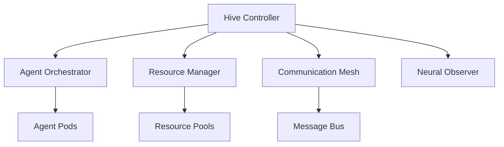
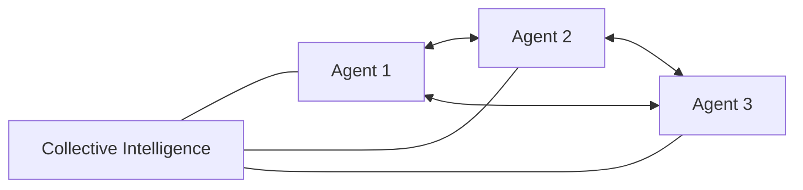
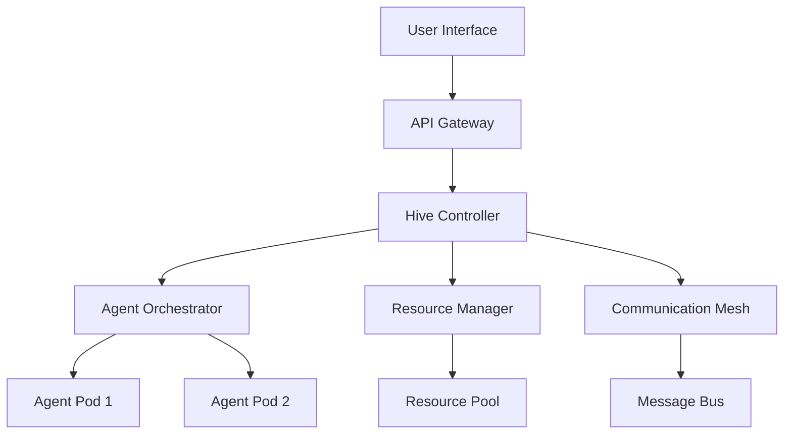
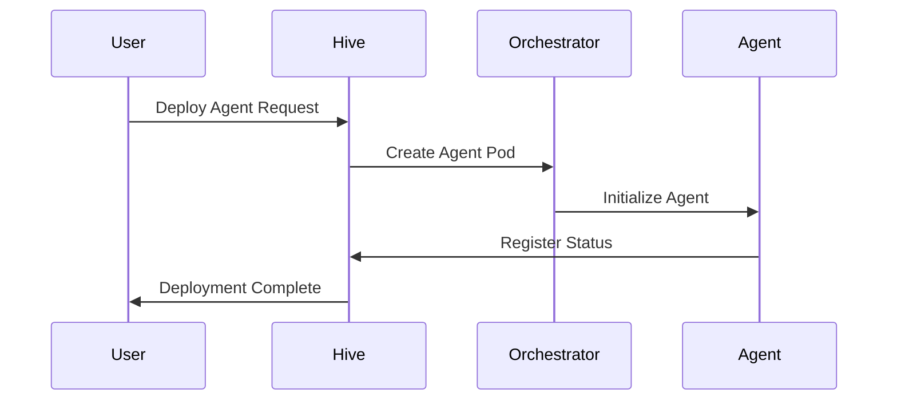

# Swarm
swarm/
├── .github/
│   ├── workflows/
│   │   ├── build.yml
│   │   ├── test.yml
│   │   └── release.yml
│   └── ISSUE_TEMPLATE/
├── api/
│   ├── v1/
│   │   ├── agent/
│   │   ├── cluster/
│   │   ├── task/
│   │   └── types.go
│   └── openapi/
│       └── swagger.yaml
├── cmd/
│   ├── swarm/
│   │   └── main.go
│   ├── swarmd/
│   │   └── main.go
│   └── swarmctl/
│       └── main.go
├── pkg/
│   ├── agent/
│   │   ├── controller/
│   │   ├── runtime/
│   │   ├── store/
│   │   └── types.go
│   ├── apis/
│   │   └── swarm/
│   │       └── v1/
│   ├── auth/
│   │   ├── authenticator/
│   │   ├── authorizer/
│   │   └── rbac/
│   ├── client/
│   │   ├── clientset/
│   │   ├── informers/
│   │   └── listers/
│   ├── cluster/
│   │   ├── controller/
│   │   ├── node/
│   │   └── service/
│   ├── communication/
│   │   ├── mesh/
│   │   ├── protocol/
│   │   └── pubsub/
│   ├── config/
│   │   ├── loader/
│   │   └── validator/
│   ├── controller/
│   │   ├── agent/
│   │   ├── cluster/
│   │   ├── node/
│   │   └── task/
│   ├── metrics/
│   │   ├── collector/
│   │   └── prometheus/
│   ├── resource/
│   │   ├── allocator/
│   │   ├── manager/
│   │   └── scheduler/
│   ├── security/
│   │   ├── certs/
│   │   ├── crypto/
│   │   └── tls/
│   ├── store/
│   │   ├── etcd/
│   │   └── interface.go
│   └── utils/
│       ├── errors/
│       ├── logger/
│       └── version/
├── internal/
│   ├── cache/
│   ├── queue/
│   └── webhook/
├── test/
│   ├── e2e/
│   ├── integration/
│   └── unit/
├── tools/
│   ├── cli/
│   └── codegen/
├── vendor/
├── web/
│   ├── api/
│   └── ui/
├── .gitignore
├── Dockerfile
├── Makefile
├── README.md
├── go.mod
└── go.sum
Here's a detailed explanation of each directory and its purpose:
markdownCopy# Directory Structure Explanation

## Root Level Directories

### /api
- Contains API definitions and OpenAPI/Swagger specifications
- Version-controlled API packages
- Type definitions shared across the project

### /cmd
- Main applications for the project
- `swarm`: CLI tool
- `swarmd`: Main daemon
- `swarmctl`: Control utility

### /pkg
Main project packages:

#### /pkg/agent
- Agent-related implementations
- Runtime management
- State storage
- Type definitions

#### /pkg/apis
- API type definitions
- Custom resource definitions
- API group implementations

#### /pkg/auth
- Authentication mechanisms
- Authorization logic
- RBAC implementations

#### /pkg/client
- Generated client code
- Informers and listers
- Client interfaces

#### /pkg/cluster
- Cluster management
- Node operations
- Service discovery

#### /pkg/communication
- Communication mesh implementation
- Protocol handlers
- Pub/sub system

#### /pkg/config
- Configuration management
- Validation logic
- Loading mechanisms

#### /pkg/controller
- Core controllers
- Reconciliation loops
- State management

#### /pkg/metrics
- Metrics collection
- Prometheus integration
- Custom metrics

#### /pkg/resource
- Resource allocation
- Scheduling logic
- Resource management

#### /pkg/security
- Security implementations
- Certificate management
- TLS configurations

#### /pkg/store
- Storage interfaces
- ETCD implementation
- Data persistence

#### /pkg/utils
- Shared utilities
- Error handling
- Logging

### /internal
- Private application code
- Not importable by other projects
- Internal utilities

### /test
- Test suites
- E2E tests
- Integration tests
- Unit tests

### /tools
- Build tools
- Code generation
- Development utilities

### /web
- API handlers
- Web UI components
- Frontend assets

## Key Files

### Root Level
- `Dockerfile`: Container build instructions
- `Makefile`: Build and development commands
- `go.mod`: Go module definition
- `go.sum`: Dependencies checksum

### Configuration
- `.github/workflows/`: CI/CD pipelines
- `.gitignore`: Git ignore patterns

  
# Table of Contents

## 1. System Overview
- [1.1 Introduction](overview/introduction.md)
- [1.2 Core Concepts](overview/core-concepts.md)
- [1.3 Architecture Overview](overview/architecture.md)
- [1.4 Key Features](overview/features.md)

## 2. Architecture
- [2.1 High-Level Architecture](architecture/high-level.md)
- [2.2 Component Communication Flow](architecture/communication-flow.md)
- [2.3 Resource Management Architecture](architecture/resource-management.md)
- [2.4 Communication Mesh Architecture](architecture/communication-mesh.md)
- [2.5 Security Architecture](architecture/security.md)
- [2.6 Monitoring and Observability](architecture/monitoring.md)
- [2.7 Data Flow Architecture](architecture/data-flow.md)
- [2.8 Deployment Architecture](architecture/deployment.md)

## 3. Data Model
- [3.1 Core Entities](data-model/core-entities.md)
  - [3.1.1 Agent](data-model/entities/agent.md)
  - [3.1.2 AgentTemplate](data-model/entities/agent-template.md)
  - [3.1.3 Cluster](data-model/entities/cluster.md)
  - [3.1.4 Node](data-model/entities/node.md)
  - [3.1.5 Communication](data-model/entities/communication.md)
  - [3.1.6 Task](data-model/entities/task.md)
  - [3.1.7 ResourceQuota](data-model/entities/resource-quota.md)
- [3.2 Relationships](data-model/relationships.md)
- [3.3 Common Structures](data-model/common-structures.md)
- [3.4 Validation Rules](data-model/validation-rules.md)
- [3.5 State Transitions](data-model/state-transitions.md)

## 4. CLI Reference
- [4.1 Command Structure](cli/command-structure.md)
- [4.2 Global Flags](cli/global-flags.md)
- [4.3 Core Commands](cli/core-commands.md)
  - [4.3.1 Agent Management](cli/commands/agent-management.md)
  - [4.3.2 Cluster Management](cli/commands/cluster-management.md)
  - [4.3.3 Communication & Messaging](cli/commands/communication.md)
  - [4.3.4 Resource Management](cli/commands/resource-management.md)
- [4.4 Configuration Management](cli/configuration.md)
- [4.5 Plugin System](cli/plugins.md)
- [4.6 Interactive Mode](cli/interactive-mode.md)

## 5. Configuration
- [5.1 YAML Specifications](configuration/yaml-specs.md)
- [5.2 Environment Variables](configuration/environment-variables.md)
- [5.3 Configuration Files](configuration/config-files.md)
- [5.4 Security Settings](configuration/security.md)

## 6. Deployment
- [6.1 Prerequisites](deployment/prerequisites.md)
- [6.2 Installation Guide](deployment/installation.md)
- [6.3 Cluster Setup](deployment/cluster-setup.md)
- [6.4 High Availability](deployment/high-availability.md)
- [6.5 Scaling](deployment/scaling.md)

## 7. Operations
- [7.1 Monitoring](operations/monitoring.md)
- [7.2 Logging](operations/logging.md)
- [7.3 Troubleshooting](operations/troubleshooting.md)
- [7.4 Backup and Recovery](operations/backup-recovery.md)
- [7.5 Upgrades](operations/upgrades.md)

## 8. Security
- [8.1 Authentication](security/authentication.md)
- [8.2 Authorization](security/authorization.md)
- [8.3 Network Policies](security/network-policies.md)
- [8.4 Secret Management](security/secrets.md)
- [8.5 Compliance](security/compliance.md)

## 9. Development
- [9.1 API Reference](development/api-reference.md)
- [9.2 Plugin Development](development/plugin-development.md)
- [9.3 Agent Development](development/agent-development.md)
- [9.4 Contributing Guidelines](development/contributing.md)
- [9.5 Testing](development/testing.md)

## 10. Best Practices
- [10.1 Production Checklist](best-practices/production-checklist.md)
- [10.2 Security Guidelines](best-practices/security-guidelines.md)
- [10.3 Performance Optimization](best-practices/performance.md)
- [10.4 High Availability Setup](best-practices/high-availability.md)

## 11. Tutorials
- [11.1 Getting Started](tutorials/getting-started.md)
- [11.2 Creating Your First Agent](tutorials/first-agent.md)
- [11.3 Scaling Agents](tutorials/scaling.md)
- [11.4 Advanced Configuration](tutorials/advanced-config.md)

## 12. Reference
- [12.1 Glossary](reference/glossary.md)
- [12.2 Error Codes](reference/error-codes.md)
- [12.3 API Endpoints](reference/api-endpoints.md)
- [12.4 Resource Limits](reference/resource-limits.md)

## 13. Release Notes
- [13.1 Version History](release-notes/version-history.md)
- [13.2 Upgrade Notes](release-notes/upgrade-notes.md)
- [13.3 Known Issues](release-notes/known-issues.md)

## Appendices
- [A. Command Reference](appendices/command-reference.md)
- [B. Configuration Examples](appendices/config-examples.md)
- [C. Troubleshooting Guide](appendices/troubleshooting.md)
- [D. Resource Planning](appendices/resource-planning.md)
1. System Overview:
Swarm is a distributed AI agent orchestration platform that enables dynamic deployment, management, and coordination of autonomous AI agents. Unlike traditional container orchestration, Swarm emphasizes agent autonomy, collective intelligence, and emergent behavior while maintaining strict resource governance.

2. Core Components:

a) Hive Controller:
- Central control plane
- Manages global state and policies
- Handles cluster-wide decisions

b) Agent Orchestrator:
- Deploys and scales agent instances
- Manages agent lifecycles
- Handles agent versioning

c) Communication Mesh:
- Implements gossip protocol for agent communication
- Maintains peer-to-peer networks
- Handles message routing and prioritization

d) Neural Observer:
- Monitors agent behavior and performance
- Implements anomaly detection
- Provides debugging and logging capabilities

3. Key Features:

a) Emergent Intelligence:

- Dynamic agent coalitions
- Collective decision-making
- Adaptive task distribution

b) Resource Elasticity:
- Neural-inspired resource allocation
- Predictive scaling
- Energy-aware computing

c) Self-healing:
- Automatic agent recovery
- State preservation
- Conflict resolution

4. Architecture Diagram:

5. Workflow:

6. Challenges and Solutions:

a) Agent Autonomy vs. Control:
- Solution: Implement hierarchical decision-making with local autonomy bounds
- Use reputation systems for trust management

b) Resource Contentions:
- Solution: Market-based resource allocation
- Priority-based preemption

c) Security:
- Solution: Zero-trust architecture
- Agent identity verification
- Secure communication channels

7. Future Expansions:

a) Cross-cluster Federation:
- Enable agent migration between clusters
- Global resource sharing

b) Advanced Intelligence:
- Meta-learning capabilities
- Evolutionary agent optimization

c) Human-Agent Collaboration:
- Natural language interfaces
- Interactive debugging
- Visual analytics

Implementation Notes:
- Built on distributed consensus using Raft algorithm
- Uses GRPC for efficient communication
- Implements WebAssembly for agent isolation
- Leverages vector databases for agent state management
