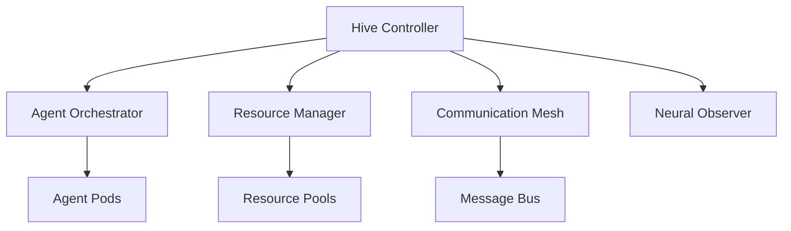
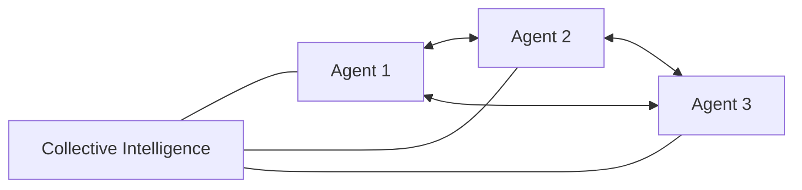
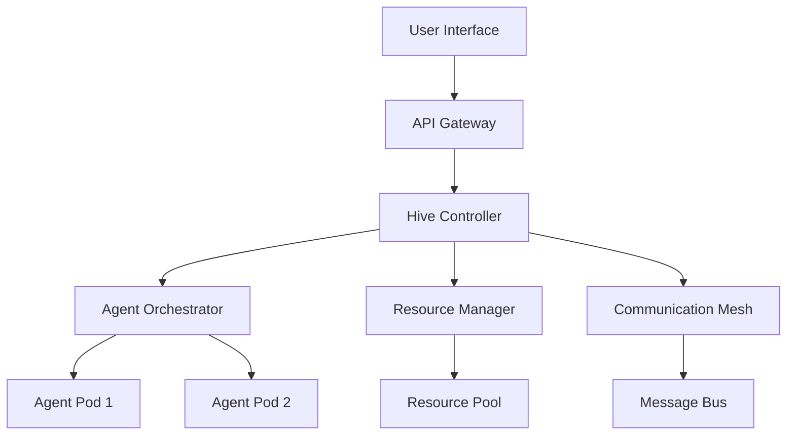
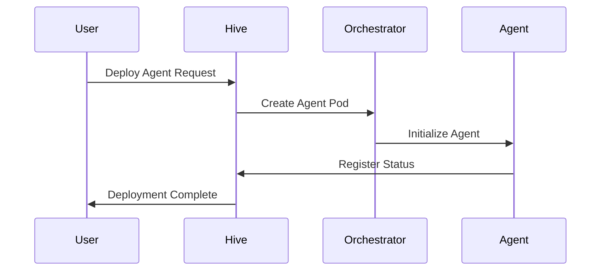

# Swarm

1. System Overview:
Swarm is a distributed AI agent orchestration platform that enables dynamic deployment, management, and coordination of autonomous AI agents. Unlike traditional container orchestration, Swarm emphasizes agent autonomy, collective intelligence, and emergent behavior while maintaining strict resource governance.

2. Core Components:

a) Hive Controller:
- Central control plane
- Manages global state and policies
- Handles cluster-wide decisions

b) Agent Orchestrator:
- Deploys and scales agent instances
- Manages agent lifecycles
- Handles agent versioning

c) Communication Mesh:
- Implements gossip protocol for agent communication
- Maintains peer-to-peer networks
- Handles message routing and prioritization

d) Neural Observer:
- Monitors agent behavior and performance
- Implements anomaly detection
- Provides debugging and logging capabilities

3. Key Features:

a) Emergent Intelligence:

- Dynamic agent coalitions
- Collective decision-making
- Adaptive task distribution

b) Resource Elasticity:
- Neural-inspired resource allocation
- Predictive scaling
- Energy-aware computing

c) Self-healing:
- Automatic agent recovery
- State preservation
- Conflict resolution

4. Architecture Diagram:

5. Workflow:

6. Challenges and Solutions:

a) Agent Autonomy vs. Control:
- Solution: Implement hierarchical decision-making with local autonomy bounds
- Use reputation systems for trust management

b) Resource Contentions:
- Solution: Market-based resource allocation
- Priority-based preemption

c) Security:
- Solution: Zero-trust architecture
- Agent identity verification
- Secure communication channels

7. Future Expansions:

a) Cross-cluster Federation:
- Enable agent migration between clusters
- Global resource sharing

b) Advanced Intelligence:
- Meta-learning capabilities
- Evolutionary agent optimization

c) Human-Agent Collaboration:
- Natural language interfaces
- Interactive debugging
- Visual analytics

Implementation Notes:
- Built on distributed consensus using Raft algorithm
- Uses GRPC for efficient communication
- Implements WebAssembly for agent isolation
- Leverages vector databases for agent state management
